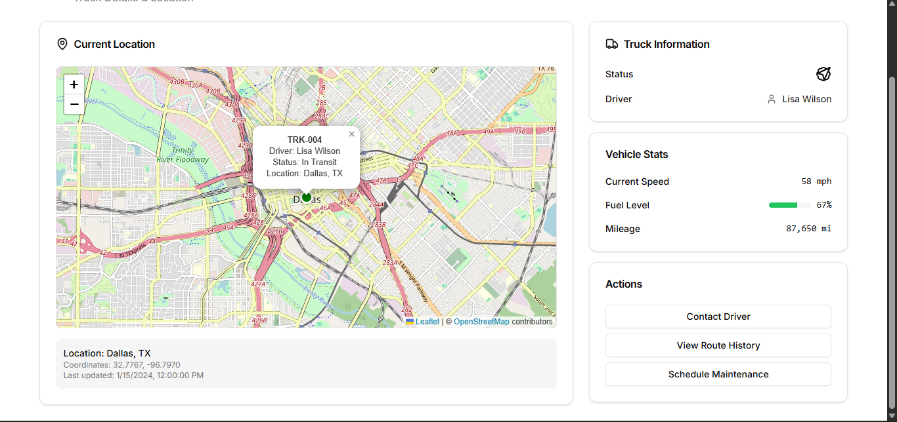

# 🚚 Logistics Fleet Dashboard

A simple **Next.js** (App Router) application built for a logistics company to:

- Display a real-time list of trucks, their statuses, and last known locations.
- Show individual truck detail pages with an interactive map.
- Provide top-of-dashboard fleet analytics (counts, averages).
- Fetch live-mocked data from a Beeceptor endpoint.

Built with **Tailwind CSS** and **Leaflet.js**.

---

## 📋 Table of Contents

1. [Demo](#-demo)
2. [Features](#-features)
3. [Tech Stack](#-tech-stack)
4. [File Structure](#-file-structure)
5. [Setup & Run Locally](#-setup--run-locally)
6. [API Mock Endpoint](#-api-mock-endpoint)
7. [Contributing](#-contributing)
8. [License](#-license)

---

## 📷 Demo

Dashboard Screenshot



---

## ✨ Features

- **Fleet Overview**: Shows all trucks with ID, driver name, status (In Transit, Idle, Maintenance), and last known city.
- **Truck Detail**: Click any truck to view details and an embedded Leaflet map pinpointing its last location.
- **Analytics**: Real-time widgets displaying total trucks, in-transit count, idle count, average distance covered, etc.
- **Mock API**: Uses Beeceptor to simulate external API calls for easy testing.
- **Responsive Design**: Layout adapts to mobile, tablet, and desktop screens using Tailwind CSS.

---

## 🛠 Tech Stack

- **Framework**: Next.js (App Router)
- **Styling**: Tailwind CSS
- **Mapping**: Leaflet.js + react-leaflet
- **Data Fetching**: fetch API (built-in)
- **Mock API**: Beeceptor
- **Type Checking**: TypeScript

---

## 📂 File Structure

```

.
├── app
│ ├── contexts
│ │ └── AppContext.tsx # Context for shared app state
│ ├── dashboard
│ │ ├── Analytics.tsx # Dashboard analytics widgets
│ │ ├── EmptyTruckContainer.tsx # Empty truck component for empty list
│ │ ├── Filter.tsx # Filter component for filtering trucks
│ │ ├── TruckItem.tsx # Truck list item component
│ │ └── page.tsx # Fleet dashboard (list + analytics)
│ ├── trucks
│ │ └── \[id]
│ │ ├── Actions.tsx # Truck actions (contact driver, vicew route history)
│ │ ├── Error.tsx # Error state for truck detail
│ │ ├── Loader.tsx # Loader for truck detail
│ │ ├── TruckInfo.tsx # Truck info component (name, status, etc)
│ │ ├── VehicleStats.tsx # Vehicle stats (distance, duration, etc)
│ │ └── page.tsx # Truck detail + map
│ ├── ui # Shared UI components
│ │ ├── ErrorComponent.tsx # Generic error component
│ │ ├── fonts.ts # Font imports
│ │ └──SkeletonLoader.tsx # Skeleton loader for loading states
│ ├── globlas.css # Global styles
│ └── page.tsx # Home landing page
│ └── layout.tsx # Root layout
├── components
│ ├── ui # Shadcn UI components
│ └── truck-map.tsx # Leaflet map component
├── lib
│ ├── Constants.ts # Global constants
│ └── utils.ts # Utility functions
├── utils
│ ├── data.ts # Mock data
│ ├── helpers.ts # Helper functions
│ └── types.ts # TypeScript interfaces
├── public
│ └── screenshots # Example images for README
├── tailwind.config.js
├── next.config.js
└── package.json

```

---

## 🚀 Setup & Run Locally

1. **Clone repository**
   ```bash
   git clone https://github.com/Venny-Dev/haul247-assessment-task.git
   cd haul247-assessment-task
   ```

````

2. **Install dependencies**

   ```bash
   pnpm install
   ```

3. **Configure Beeceptor**

   - Create your Beeceptor endpoint (e.g., `https://haul247-backend.free.beeceptor.com/api/trucks`).
   - Replace the endpoint URL in `app/dashboard/page.tsx` and `app/trucks/[id]/page.tsx`.

4. **Run development server**

   ```bash
   pnpm dev
   ```

5. **Open in browser**

   Visit `http://localhost:3000` to view the dashboard.

---

## 🔗 API Mock Endpoint

**GET** `https://haul247-backend.free.beeceptor.com/api/trucks`

Example response:

```json
[
  {
    "id": "TRK001",
    "driver": "John Doe",
    "status": "In Transit",
    "location": {
      "city": "Dallas",
      "lat": 32.7767,
      "lng": -96.797
    }
  }
]
```
````
